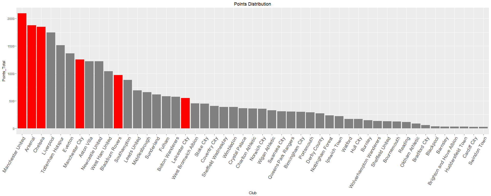

Bayesian Model Analysis of English Premier League
================
Akshay Kamath, Purvi Thakor
April 7, 2018

### Problem Definition & Motivation:

Analysis of sports data has piqued high research interests to serve many goals such as improving performance of players, preparing winning strategies, analyzing post-game statistics and many others. I, Akshay, follow soccer religiously & when we came across this dataset, we decided that it would be an interesting project to work on. We are keen to see if our models can predict game outcomes looking at history of soccer matches.

We initially started out with collating data from the EPL website (<https://www.premierleague.com/home>). The data is collected for 26 seasons (including the current one) from 1992-93 to 2017-18. The data is collected at match level & results level (2017-18).

    ## Warning: package 'plotrix' was built under R version 3.4.3

    ## Warning: package 'ggalt' was built under R version 3.4.4

    ## Loading required package: ggplot2

    ## Warning: package 'ggplot2' was built under R version 3.4.4

    ## Warning: package 'knitr' was built under R version 3.4.4

    ## Warning: package 'sqldf' was built under R version 3.4.4

    ## Loading required package: gsubfn

    ## Warning: package 'gsubfn' was built under R version 3.4.2

    ## Loading required package: proto

    ## Warning: package 'proto' was built under R version 3.4.2

    ## Loading required package: RSQLite

    ## Warning: package 'RSQLite' was built under R version 3.4.4

    ## Loading tidyverse: tibble
    ## Loading tidyverse: tidyr
    ## Loading tidyverse: readr
    ## Loading tidyverse: purrr
    ## Loading tidyverse: dplyr

    ## Warning: package 'dplyr' was built under R version 3.4.2

    ## Conflicts with tidy packages ----------------------------------------------

    ## filter(): dplyr, stats
    ## lag():    dplyr, stats

    ## Warning: package 'reshape' was built under R version 3.4.4

    ## 
    ## Attaching package: 'reshape'

    ## The following object is masked from 'package:dplyr':
    ## 
    ##     rename

    ## The following objects are masked from 'package:tidyr':
    ## 
    ##     expand, smiths

    ## Warning: package 'rjags' was built under R version 3.4.3

    ## Loading required package: coda

    ## Warning: package 'coda' was built under R version 3.4.3

    ## Linked to JAGS 4.3.0

    ## Loaded modules: basemod,bugs

    ## Warning: package 'mcmcplots' was built under R version 3.4.4

    ## 
    ## Attaching package: 'data.table'

    ## The following object is masked from 'package:reshape':
    ## 
    ##     melt

    ## The following objects are masked from 'package:dplyr':
    ## 
    ##     between, first, last

    ## The following object is masked from 'package:purrr':
    ## 
    ##     transpose

``` r
setwd("D:/Spring 2018/Bayesian Methods for Data Science/Final Project/git")
df = read.csv("season_on_season.csv")

distinct_clubs=sqldf('select count(distinct Club) as "Distinct Clubs in PL since 2005-06" from df') 

distinct_clubs
```

    ##   Distinct Clubs in PL since 2005-06
    ## 1                                 49

As we can see, the Premier League has had 49 teams participate in it since 1992-93 till the current season.

Now to look at teams' participation across seasons, we plotted a chart called the Quick plot with ggplot2

``` r
qplot(Season,Club,data = df, geom=c("point","line"),xlab = "Participation by Season", color = I("Black"))
```

    ## geom_path: Each group consists of only one observation. Do you need to
    ## adjust the group aesthetic?


``` r
Appearance = sqldf('select distinct(Club), count(distinct(Season)) as Appearance from df group by Club order by Appearance DESC')
Appearance
```

    ##                        Club Appearance
    ## 1                   Arsenal         26
    ## 2                   Chelsea         26
    ## 3                   Everton         26
    ## 4                 Liverpool         26
    ## 5         Manchester United         26
    ## 6         Tottenham Hotspur         26
    ## 7               Aston Villa         24
    ## 8          Newcastle United         23
    ## 9           West Ham United         22
    ## 10          Manchester City         21
    ## 11              Southampton         19
    ## 12         Blackburn Rovers         18
    ## 13               Sunderland         16
    ## 14            Middlesbrough         15
    ## 15         Bolton Wanderers         13
    ## 16                   Fulham         13
    ## 17             Leeds United         12
    ## 18           Leicester City         12
    ## 19     West Bromwich Albion         12
    ## 20               Stoke City         10
    ## 21            Coventry City          9
    ## 22           Crystal Palace          9
    ## 23        Charlton Athletic          8
    ## 24             Norwich City          8
    ## 25      Sheffield Wednesday          8
    ## 26           Wigan Athletic          8
    ## 27                Wimbledon          8
    ## 28          Birmingham City          7
    ## 29             Derby County          7
    ## 30               Portsmouth          7
    ## 31      Queens Park Rangers          7
    ## 32             Swansea City          7
    ## 33                Hull City          5
    ## 34             Ipswich Town          5
    ## 35        Nottingham Forest          5
    ## 36                  Watford          5
    ## 37                  Burnley          4
    ## 38  Wolverhampton Wanderers          4
    ## 39              Bournemouth          3
    ## 40                  Reading          3
    ## 41         Sheffield United          3
    ## 42            Bradford City          2
    ## 43          Oldham Athletic          2
    ## 44                 Barnsley          1
    ## 45                Blackpool          1
    ## 46 Brighton and Hove Albion          1
    ## 47             Cardiff City          1
    ## 48        Huddersfield Town          1
    ## 49             Swindon Town          1

``` r
Appearance = sqldf('select distinct(Club) as Club, count(distinct(Season)) as Season_Count, sum(Points) as Points_Total from df group by Club order by Points_Total Desc,Season_Count Desc')

Appearance.Fill <- ifelse(Appearance$Club %in% c("Manchester United","Arsenal","Chelsea","Blackburn Rovers","Leicester City", "Manchester City"),"yes","no")
Appearance
```

    ##                        Club Season_Count Points_Total
    ## 1         Manchester United           26         2092
    ## 2                   Arsenal           26         1876
    ## 3                   Chelsea           26         1846
    ## 4                 Liverpool           26         1744
    ## 5         Tottenham Hotspur           26         1514
    ## 6                   Everton           26         1365
    ## 7           Manchester City           21         1255
    ## 8               Aston Villa           24         1223
    ## 9          Newcastle United           23         1221
    ## 10          West Ham United           22         1038
    ## 11         Blackburn Rovers           18          970
    ## 12              Southampton           19          881
    ## 13             Leeds United           12          692
    ## 14            Middlesbrough           15          661
    ## 15               Sunderland           16          618
    ## 16                   Fulham           13          586
    ## 17         Bolton Wanderers           13          575
    ## 18           Leicester City           12          551
    ## 19     West Bromwich Albion           12          454
    ## 20               Stoke City           10          451
    ## 21            Coventry City            9          409
    ## 22      Sheffield Wednesday            8          392
    ## 23                Wimbledon            8          391
    ## 24           Crystal Palace            9          367
    ## 25        Charlton Athletic            8          361
    ## 26             Norwich City            8          359
    ## 27           Wigan Athletic            8          331
    ## 28             Swansea City            7          311
    ## 29      Queens Park Rangers            7          308
    ## 30          Birmingham City            7          301
    ## 31               Portsmouth            7          293
    ## 32             Derby County            7          274
    ## 33        Nottingham Forest            5          239
    ## 34             Ipswich Town            5          224
    ## 35                  Watford            5          174
    ## 36                Hull City            5          171
    ## 37                  Burnley            4          152
    ## 38  Wolverhampton Wanderers            4          136
    ## 39         Sheffield United            3          132
    ## 40              Bournemouth            3          126
    ## 41                  Reading            3          119
    ## 42          Oldham Athletic            2           89
    ## 43            Bradford City            2           62
    ## 44                Blackpool            1           39
    ## 45                 Barnsley            1           35
    ## 46 Brighton and Hove Albion            1           35
    ## 47        Huddersfield Town            1           32
    ## 48             Cardiff City            1           30
    ## 49             Swindon Town            1           30

``` r
#plotting Total Points across Season Appearance

ggplot(data=Appearance,aes(x=Club,y=Points_Total,fill=Appearance.Fill,group=1))+
  geom_bar(stat = "identity")+
  scale_fill_manual(values=c("grey50", "red"),guide="none") +
  theme(axis.text.x = element_text(angle = 60, hjust = 1,size=14))+
  scale_x_discrete(limits=Appearance$Club)+
  ggtitle("Points Distribution")+
  theme(plot.title = element_text(hjust = 0.5))
```

 We can see, Manchester United have the highest number of points accumulated in these 26 seasons with Arsenal in the second place. Incidently, Manchester United have won 13 league titles, Chelsea - 5, Arsenal - 3, Manchester City - 2, Blackburn Rovers & Leicester City one apiece.

``` r
ggplot(data = Appearance, aes(x=Club, y=Season_Count,color="blue9",group = 1))+
  scale_fill_manual(values=c("blue9"),guide="none") +
  geom_point(data = Appearance, aes(x = Club, y = Season_Count)) + 
  geom_line(data = Appearance, aes(x = Club, y = Season_Count)) + 
  theme(axis.text.x = element_text(angle = 60, hjust = 1,size=14),axis.title =
          element_text(size=14,face="bold")) +
  scale_x_discrete(limits=Appearance$Club)+
  ggtitle("Seasons in the Premier League")+
  theme(plot.title = element_text(hjust = 0.5))
```


6 clubs have never been relegated from the Premier League since its inception in 1992-93. They are :-

Arsenal Chelsea \*Everton Liverpool Manchester United Tottenham Hotspur

\*We have replaced Everton with Manchester City even though have been relegated in 2000-01,1997-98,1995-96. Since they have won the league twice since the 2005-06 season, we have included them in the top clubs.

``` r
topclubs = c(Club="Manchester United","Liverpool","Arsenal","Chelsea","Tottenham Hotspur","Manchester City")
topclubs = filter(df, df$Club %in% topclubs)

ggplot(topclubs, aes(x = Season, y = Points, group=Club, color = Club))+
  geom_line(size=1,linetype="dotdash")+
  theme(panel.grid.major = element_blank(),
        panel.grid.minor = element_blank(),
        panel.background = element_blank())+
  geom_xspline(aes(y = Points), size = 1,
               spline_shape = 0,linetype=1)+
  theme(axis.text.x = element_text(angle = 60, hjust = 1))+ 
  ggtitle("Season on Season Finishes")+
  theme(plot.title = element_text(hjust = 0.5))
```


``` r
goals_distribution <- sqldf('select Club, sum(GF) as Goals_Scored, sum(GA) as Goals_Conceded from topclubs group by Club order by Club')
goals_distribution <- melt(goals_distribution,id="Club")
goals_distribution <- goals_distribution[order(-goals_distribution$value),]

ggplot(data=goals_distribution,aes(x=Club,y=value,fill=variable))+
  geom_bar(stat="identity",position = 'dodge')+
  xlab("Club")+
  ylab("Goals")+
  ggtitle("Goals Distribution")+
  theme(axis.text.x = element_text(angle = 60, hjust = 1))+
  theme(plot.title = element_text(hjust = 0.5))
```


``` r
goals_difference <- sqldf('select Club, sum(GD) as Goal_Difference from topclubs group by Club order by Club')

goals_difference = mutate(goals_difference, 
                   difference_pct = round((goals_difference$Goal_Difference   / sum(goals_difference$Goal_Difference))*100,2))

labs <- sprintf("%s: %.1f%%", goals_difference[,1], goals_difference[,3])                                
piecolors <- colors()[c(144,26,134,430,555,253)]
pie3D(goals_difference$Goal_Difference, labels = labs, main="Goals Scored - Goals Conceded %", 
    border="black", radius = 1, labelcex=1, explode=0.05, theta = 0.8, start = .5, col=piecolors)
```


Looking at the top clubs, we can see that Manchester United have the best Goal Difference 28% (Goals Scored - Goals Allowed). This reflects on their 13 Premier League Titles. They are followed b Arsenal at 21%, Chelsea at 19%, Liverpool at 17%, Manchester City at 8% & Tottenham at 5.5%

``` r
#dev.off()
topclubs <- topclubs[c('Club','Points')]
topclubs$Club <- factor(topclubs$Club)

ggplot(topclubs, aes(Club, Points, fill=Club))+
  geom_boxplot()+
  theme_bw()+
  theme_light()+
  theme(axis.text.x = element_text(angle = 60, hjust = 1))+
  geom_jitter(shape=16, position=position_jitter(0))+
  ggtitle("Points distribution across 26 PL Seasons")+
  theme(plot.title = element_text(hjust = 0.5))
```


Arsenal & Manchester United have been the most consistent teams across the 26 seasons since they have smaller box plots. Manchester City, who were relegated thrice, but have still won the league twice, have the biggest box plot.

Initially, when the Premier League was formed, there were 22 teams in the league. After the 1995-96 season, the number of teams in the league were reduced to 20. Each team plays the opponent twice in a season in this competition. i.e. Each team plays the 38 games. These 38 games are divided into Home fixtures & Away fixtures, i.e each team plays 19 games at home & 19 away in each season.

Statistically, teams tend to win more games at Home as compared to Away. Since the 2017-18 season has almost reached its climax with only a few rounds remaining, we decided to work on the current season & tried to predict the probability of home teams winning games. At the time of building the model, we had 304 matches that were played. We have 380 matches in a season, ergo, we had 76 matches left in the season.

### General Bradley-Terry Model for Pair-wise comparison

We came across a model called the Bradley-Terry Model which is a simple model to describe the probabilities of possible outcomes in paired comparisons.

The assumptions of the Bradley-Terry model can be explained.

1.  if a good team plays a bad team, the probability of the good team winning is higher.

2.  if a good team plays a good team, the probability of the each team winning is around 50%.

According to this model,

                      P[A beating B] =      Ability(A)
                                      ______________________
                                      Ability(A) + Ability(B)
              
                      *where Abilities are arbitary numbers allocated to the teams.

Based on this, we arbitarily declare a team's ability. Since, the Premier League has 20 teams, we arbitarily give them numbers (1-20). We decided to give these numbers based on the alphabetical order. i.e 1-Arsenal,2-Bournemouth etc.

We had to transform our results level data in order to incorporate the model. For the model to function, instead of using team names, we used their team numbers (arbitary numbers assigned above) & converted the results of the matches to a binary format(i.e - Home Win = 1, Home Loss = 0)

``` r
fixture_results<-read.csv("Results_Level.csv")

game_data_home<-fixture_results[,c("Home_Code","Away_Code","Win_H")]

data<-list(Home_Code=game_data_home$Home_Code,Away_Code=game_data_home$Away_Code,Win_H=game_data_home$Win_H)
data
```

    ## $Home_Code
    ##   [1] 16  8  2 10 16  1  2 12 20 19 13  8  7  5  6  3 11  4 18 15 17 14  9
    ##  [24] 10  1  6 12  9 19 10  4  3  2 18  5  8 13 14  7 11 15 20 17 16 18  6
    ##  [47] 10  4 19 12  9  3  2  1 14 13  7  5 15 16 11 20 17  8 17 14  3 20 16
    ##  [70]  9  7  4  1 11 12  2 10  6  5 15 19 18 13  8 15  1 20 17 14 11  3 16
    ##  [93]  9  4  7  6 19 18 13 10  8  5  2 12  6 13 15 19 18 12  8  5  2 10 16
    ## [116] 14 11  3  4  9  7 20 17  1  7 19  2  9 18  5  3  1 16 11 17 14 13 20
    ## [139] 15 12 10  4  8  6 14 10 12 20 15 17  8  6  4 13  2 11  9  7  3  1  5
    ## [162] 19 18 16  5  2  1 16 11  7  9  3 19 18 14  4  8 15 17 13 12  6 10 20
    ## [185]  3 18  1 19 10  9  6  4  2 12 15 11  7  5  8 20 16 17 14 13  4  3  9
    ## [208] 12 19 18 10  6  1  2  7 15  5 17 16 13 11  8 14 20  9  3 14 10 15 17
    ## [231] 11  6  4 18  1  7 13 12  2  5  8 20 19 16  1  3 20 17 16 14 11  7  4
    ## [254]  9  5 12  6 19 18 13 10  8 15  2 20  4 17 11 14  9  7  3  1 16 19  5
    ## [277] 15 10  6 12  2 18 13  8 11  8 15 17 14 10  9  4  2 16 13 12 18 19 14
    ## [300]  7  6  5  3  1
    ## 
    ## $Away_Code
    ##   [1]  7  6 19 18 11 18 15 10  4  9 14 17  3  6 12  1  5  7 19  8 20 16  2
    ##  [24] 13 11 15  5 16  8 20 14 17 13  7 19  2 12 10  6  9  1 18  4  3  5 13
    ##  [47] 15 11 14  8 17 20 16  7  3  4  9  2 12 18 19  6  1 10 10 15  5  2  8
    ##  [70] 18 19 12  6 13 16  1 11  4  9  7  3 14 17 20 20  5 19 15  6 18  2 13
    ##  [93]  8 10 12 11  1 17  3  9  4 16  7 14  1 11 14  7  9  4 16  3 20 17 19
    ## [116]  8  2 18 15 12  5 13  6 10 17 12 10  6  8 14  4 13 20 15 11  9  7  1
    ## [139]  3  2 19 16  5 18  1  7 11  5 16 19  3  2 18  9 14 20  4  8 10 12 13
    ## [162]  6 15 17 17  4  8 10 14 20 15  6 13 12  7  1 11 19  2 18  3 16  5  9
    ## [185] 16 20 15  5 14 11  7 17  8 13  6  1 18 12 19 10  9  3  4  2 13 14  7
    ## [208] 15 11 16  8 20 17  5  1 10 18  9  2  6  4 12 19  3 19  7 13 12  2  8
    ## [231] 16  5 20  1  3  4 10  6  9 11 15 17 18 14 19 13 15 18  5 12  6  2  8
    ## [254] 10  1  7 14 20 11 16  4  9 17  3  8  6 13 10 18  5 15 19  2 12 16  7
    ## [277]  4  1 17  9 11  3 20 14  7 13  5 12 20  6  3 19 18  1 15 20 10  2 17
    ## [300] 16  8  4 11  9
    ## 
    ## $Win_H
    ##   [1] 0 0 1 1 0 1 0 1 0 0 1 0 1 1 0 1 1 1 1 1 1 0 0 1 0 0 1 0 0 1 0 1 0 1 1
    ##  [36] 1 1 0 1 1 1 1 1 0 1 0 0 0 0 1 0 1 1 1 0 0 1 0 1 0 1 0 1 0 1 0 0 0 1 1
    ##  [71] 0 0 1 1 1 1 1 1 0 1 1 0 0 0 0 0 1 0 0 1 0 0 1 0 0 0 0 0 0 1 0 1 1 0 0
    ## [106] 0 1 0 1 0 0 1 0 1 1 0 1 1 0 0 0 0 0 0 1 0 0 0 0 1 0 1 0 1 0 0 0 0 1 1
    ## [141] 0 1 0 1 0 0 0 1 1 1 1 0 1 0 0 1 1 1 0 0 1 0 0 1 1 0 1 0 1 1 1 0 0 0 1
    ## [176] 0 0 0 0 0 1 1 0 0 0 1 1 0 1 0 0 1 1 1 1 1 1 1 1 0 0 0 0 0 1 0 1 1 0 0
    ## [211] 1 0 1 0 0 1 1 0 0 1 1 1 1 0 0 0 0 0 1 1 1 1 0 1 1 0 0 1 0 0 0 1 0 1 1
    ## [246] 1 0 0 0 0 1 1 0 0 0 1 0 0 0 1 0 0 0 1 1 1 0 1 0 0 0 1 1 0 0 1 0 1 0 1
    ## [281] 0 0 1 0 0 1 0 0 1 1 1 0 0 1 0 1 0 1 0 1 0 0 0 1

As we can see above, the Home\_Code & the Away\_Code are team numbers assigned arbitarily & the Win\_H variable shows whether the Home team won or not.

Looking at the first game, we can see that team 16 played team 7 at home. The 0 in Win\_H indicates that the away team (7) won the tie. This points to some evidence that team 7 is better than team 16. What we're trying to indicate is that teams which beat other teams more times are better teams obviously.

We start with the prior distribution for all 20 teams and update to a posterior distribution for the 2017-18 season data. Using the generated posteriors, we then predict the future data.

We are trying to create a log normal distribution. We have a log ability for each team & we give it a Standard Normal Prior with mean, 0 & (1/variance), 1.

*Prior Distribution*

      for (i in 1:"no of teams")
      
      {
        
        log_ability[i] ~ dnorm(0,1)
        
        ability[i] <- exp(log_ability[i])
      
      }

This gives us abilities which are going to differ, but not by a lot. Meaning, with the Standard Normal Distribution, the typical ratio of abilities will be something like 2:1 or 5:1 or 10:1, but not more extreme than that.

The dnorm (Normal Distribution) is an informative prior which is narrow since a wide prior would give us weird conclusions.

*Likelihood/ Sampling Distribution (implementing the Bradley-Terry Model Assumption)*

    for (i in 1:Matches)

    {
        prob[i]<-ability[Home_Code[i]]/(ability[Home_Code[i]]+ability[Away_Code[i]])
        
        Win_H[i]~dbin(prob[i],1)
        
    }
                  

In the above section, we've translated the B-T model to the jags format. The prob i defines the probability of the home team winning the tie using the B-T model. We need a 0 or a 1 when predicting if the Home team won or not. Hence we use a probability density function (pdf) which has a sample space of 0 to 1. This means we use a Bernoulli distribution or a Binomial Distribution with 1 trial.

The 0s & 1s of the Home team winning or not follows a binomial distribution. The success probability for the ith match is prob\[i\] & the number of trials is 1 since we are looking at one match at a time. The dbin is a Binomial Distribution in jags with first element as the probability of success & the second element as the number of trials.

We have the posterior samples of the Home team & Away team's abilities. Given these, we now would want to predict the Home Team's win.

*Home Team's winning probability*

      prob_next <- ability[3]/(ability[3]+ability[15])
      home_win~dbin(prob_next,1)

The posterior mean of a probability (given the parameters) is the probability (not given the parameters).

Using the formula above, we are trying to predict the home team's probability to win the tie. Home team has prob\_next as the probabilty of winning the tie.

``` r
model1="
model
{

  #Prior Dist for Abilities
  for (i in 1:20)
  {
  log_ability[i]~dnorm(0,1)
  ability[i] <- exp(log_ability[i])
  }

  #Likelihood/ Sampling Distribution (implementing the Bradley-Terry Model Assumption)
  for (i in 1:304)
  {
  prob[i] <- ability[Home_Code[i]]/(ability[Home_Code[i]]+ability[Away_Code[i]])
  Win_H[i]~dbin(prob[i],1)
  }

  # Home Team's winning probability 
  # Here, we are predicting the probability of the home team (#6 Crystal Palace) winning against the away team (#10 Liverpool)  

  prob_next <- ability[6]/(ability[6]+ability[10])
  home_win~dbin(prob_next,1)
  }
"
writeLines(model1,con="model1.txt")

burn_in = 1000
steps = 100000
thin = 1

variable_names=c("ability","home_win")

jagsModel = jags.model( "model1.txt",data = data)
```

    ## Compiling model graph
    ##    Resolving undeclared variables
    ##    Allocating nodes
    ## Graph information:
    ##    Observed stochastic nodes: 304
    ##    Unobserved stochastic nodes: 21
    ##    Total graph size: 1565
    ## 
    ## Initializing model

``` r
s1 <- coda.samples(jagsModel, 20000, thin = 1, variable.names = variable_names)

plot(s1[,6],type="l")
```


``` r
ms1<-as.matrix(s1)

testing <- rbindlist(lapply(s1, as.data.frame))

paste("Home Team's winning chance is ",mean(testing$home_win*100),"%")
```

    ## [1] "Home Team's winning chance is  23.05 %"

The home team (\#6 Crystal Palace) in this tie has a *22.5%* chance of winning the tie against the away side (\#10 Liverpool).

Liverpool are arguably a better team competing for a position in the Champions League & the Premier League whereas Crystal Palace are fighting against relegation. Obviously, Liverpool have a higher probability of beating Crystal Palace.

Post predicting this winning percent, we did see that Liverpool defeated Crystal Palace 2-1 at Crystal Palace's home, thus validating our model.

### Hierarchical Model in Bradley-Terry Model

In model1, in dnorm(0,1), the 1 determines how different the teams are going to be.

If we had chosen 0.3 instead of 1 it would mean that the teams' abilities are closer to each other. But if we took 2 instead of 1, it would mean that the teams' abilities are far apart. But we don't know whether it should be 0.3 or 1 or 2. In model1 we arbitarily selected 1.

Now, in model2 we are implementing a Hierarchical Model within the Bradley-Terry model. In model1 instead of the second parameter (i.e 1/Variance = 1) we introduce a hyperparameter & we set a prior for that hyperparameter.

*Hyperparameter*

                              diversity ~ dunif(0,2)

Diversity is some number between 0 and 2 that describes the standard deviation of log abilities of the teams. Basically, the diversity of the teams' abilities. If it were from 0 to 1 it would be same as our first model.

Now, the Normal distribution feature in jags has mean as the first parameter and the second parameter as (1/variance) which is 1/(std deviation)^2.

Basically, diversity gives you the standard deviation.

To summarize, instead of assuming our priors are log normal with a diversity of 1, we are assuming that it is follows a log normal distribution with an unknown diveristy (hyperparameter).

Here, diversity is the hyperparameter that determines that given diversity. We then know what the prior would be for the abilities and the rest of the model remains the same. Basically, a hyperparameters just give us a different prior.

``` r
model2="
model
{
  #Hyperparameter
  
  diversity ~ dunif(0,2)
  
  #Prior Dist for Abilities
  for (i in 1:20)
  {
  log_ability[i]~dnorm(0,1/diversity^2)
  ability[i] <- exp(log_ability[i])
  }
  
  #Likelihood/ Sampling Distribution (implementing the Bradley Terry Model Assumption)
  for (i in 1:304)
  {
  prob[i] <- ability[Home_Code[i]]/(ability[Home_Code[i]]+ability[Away_Code[i]])
  Win_H[i]~dbin(prob[i],1)
  }
  
  prob_next <- ability[6]/(ability[6]+ability[10])
  home_win~dbin(prob_next,1)
}
"
writeLines(model2,con="model2.txt")

burn_in = 1000
steps = 100000
thin = 1
variable_names=c("ability","home_win","diversity")

jagsModel = jags.model( "model2.txt",data = data)
```

    ## Compiling model graph
    ##    Resolving undeclared variables
    ##    Allocating nodes
    ## Graph information:
    ##    Observed stochastic nodes: 304
    ##    Unobserved stochastic nodes: 22
    ##    Total graph size: 1569
    ## 
    ## Initializing model

``` r
s1 <- coda.samples(jagsModel, 20000, thin = 1, variable.names = variable_names)
ms1 <- as.matrix(s1)

plot(s1[,6],type = "l")
```


``` r
testing <- rbindlist(lapply(s1, as.data.frame))

paste("Home Team's winning chance is ",mean(testing$home_win*100),"%")
```

    ## [1] "Home Team's winning chance is  25.33 %"

After running the Hierarchical model, we see that the Home Win percent has increased to 25% from 22%. So, it did make a small difference to our prediction.

We also monitored the hyperparameter (diversity) and looked at its posterior distribution.

Let's look at the posterior distribution of the the diversity hyperparameter and what the data thinks is the most likely value of the diversity.

``` r
ggplot(data=testing,aes(testing$diversity))+
  #geom_histogram(breaks=seq(0,2,.02),fill="navyblue",col="white",alpha=.5)
  geom_histogram(breaks=seq(0,2,.02),col="red",aes(fill=..count..))+
  scale_fill_gradient("Count", low = "red", high = "yellow")+
  ggtitle("Histogram of Diversity")+
  theme(plot.title = element_text(hjust = 0.5))+
  xlab("Diversity")+
  ylab("Frequency")
```


From the histogram we can see that the posterior distribution peaks around 0.75. It's prior was uniform and the assumption of model 1 was equivalent to knowing or assuming the diversity was 1.

But now we have actually measured it from the data and it is more likely to be less than 1. So what that means is our initial guess of 1 for how different the teams were was a bit of an over-estimate. Maybe teams are more closer than what we thought.

Basically, the teams' abilities are not that far apart.

So, if this diversity is inferred to be less than 1, teams are more close, prediction is harder, the probability goes towards 50%.

### Closing Remarks

1.  The Bradley-Terry Model does not incorporate the possibility of drawing a game. This severely hampers the ability to use this model in cases where we can have draws. We looked at the simplest form of this model & applied it on our data. More complex models like the Davidson model incorporate the probability of a draw.

2.  Sports is not an easy field to predict. Especially a multi-million dollar business. Factors like the spending power of a team to buy better players is something that heavily affects the outcome of a tournament. Richer teams, obviously, with higher transfer budgets and wage bills have a higher probability to attract better players & thus perform better than those who can't afford to spend big amounts.

3.  Additional factors like player form, the weather on game day vary from game-to-game. This is something that we've not used in our model either.
